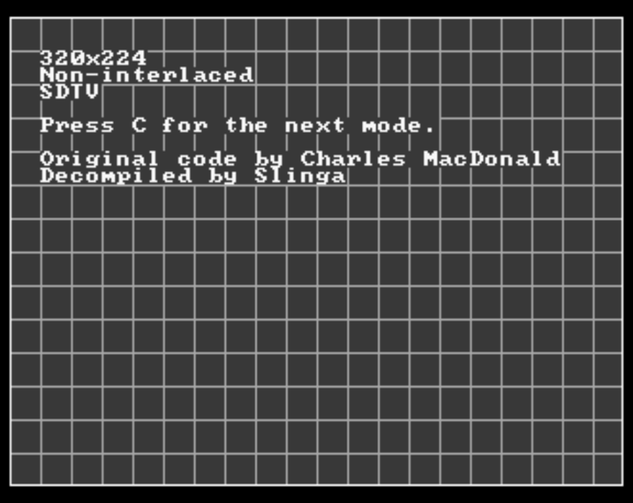

# 480P Mode Demo
Decompilation attempt of Charles MacDonald's 480P Mode demo for the Sega Saturn. The original ISO is available here: https://segaxtreme.net/threads/progressive-hires-test-demo.15539/. This code allows you to try a number of different resolutions on the Saturn. I don't plan to refactor the code as I want to keep it as close as possible to to the original binary.

Build the code with joengine or grab an ISO from [releases](https://github.com/slinga-homebrew/480P-Mode-demo/releases).

## Compatibility
The decompiled code appears to work the same as the original binary on Mednafen and on real hardware.
* Mednafen seems to have issues with 480P modes. This doesn't happen on real hardware.
* Real hardware requires the use of SCART cables for the 480P modes. I have only tested using SCART -> OSSC -> HDMI and the 480P modes appear to work. Once my HD Retrovision cables arrive I will repeat the test Component -> OSSC and Component -> direct TV to see if they will also work. 

## Credits
* Charles MacDonald for the original program and for answering questions
* Steve Kwok for explaining 480P settings
* [joengine](https://github.com/johannes-fetz/joengine) - Sega Saturn build environment and API
* [libyaul](https://github.com/ijacquez/libyaul) - Another Sega Saturn library. I used the bios_clock_speed_chg() function and VDP2 register definitions from here
* [Ghidra](https://github.com/NationalSecurityAgency/ghidra) - open source reverse engineering tool
* [Ghidra Sega Saturn Loader](https://github.com/VGKintsugi/Ghidra-SegaSaturn-Loader) - Sega Saturn loader for Ghidra
* [SegaXtreme](http://www.segaxtreme.net/) forums - best place for Sega Saturn dev questions
